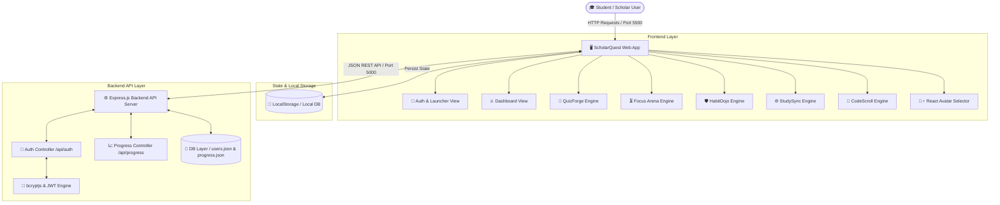
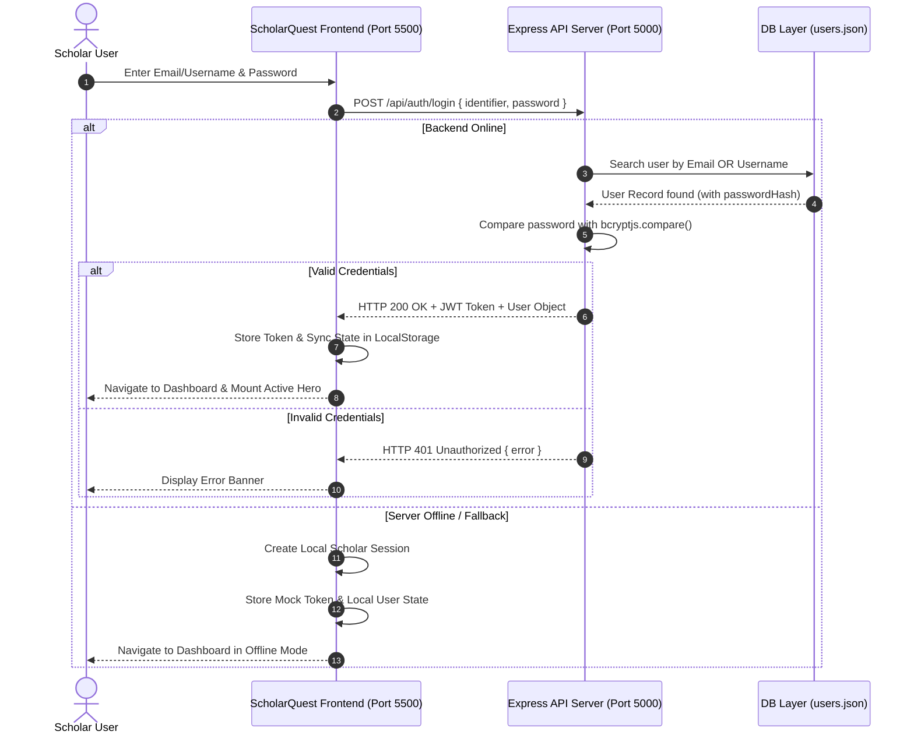
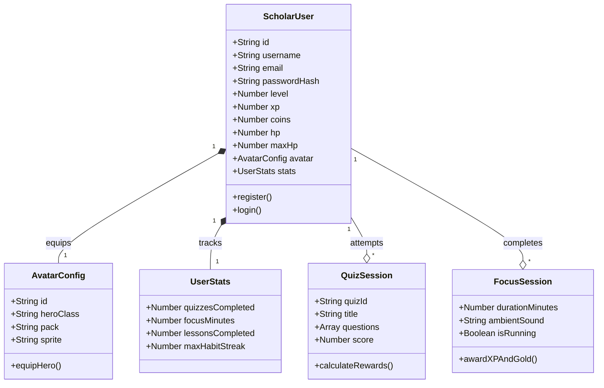
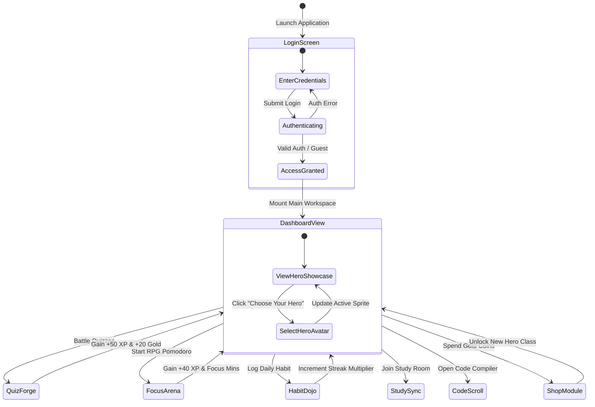

# ⚔️ ScholarQuest: Gamified Learning & Study Management Platform
**Master of Science in Information Technology (MSc IT) Project Report**  
*Academic Year 2025–2026*

---

## 📋 Executive Abstract

**ScholarQuest** is an innovative, full-stack gamified learning and study management web application designed to transform traditional academic productivity into an immersive Role-Playing Game (RPG) experience. Students often struggle with motivation, study consistency, and burnout when preparing for technical coursework and software development challenges. 

ScholarQuest addresses this problem by integrating core study utilities—such as interactive battle quizzes (**QuizForge**), RPG Pomodoro focus timers with ambient audio (**Focus Arena**), daily study habit tracking (**HabitDojo**), real-time collaborative study rooms (**StudySync**), and an interactive code compiler (**CodeScroll**)—into a unified gamified ecosystem. 

As students complete study tasks and quizzes, they earn Experience Points (XP), Level upgrades, and Gold coins, allowing them to unlock new pixel-art hero avatar classes (ranging from *The Scholar* to *Grand Archmage*) and customize their learning journey. Built with a responsive, high-performance web architecture (Vanilla JS/CSS3 Glassmorphic UI with React components and a Node.js/Express REST API backend), ScholarQuest features robust dual-identifier authentication (Email or Username), password recovery, social OAuth integration (Google, GitHub, LeetCode), and resilient offline session fallbacks.

---

## 🚀 System Modules & Functionalities

| # | Module Name | Core Functionality & Features |
|---|---|---|
| 1 | **Authentication & Identity Launcher** | • Dual-identifier login (accepts both **Email Address** and **Username**). • Account registration with hashed passwords (`bcryptjs`). • 6-digit OTP password recovery workflow. • Social SSO authentication integration (Google 🌐, GitHub 🐙, LeetCode ⚔️). • Guest Preview Mode & persistent JWT session management with offline fallback. |
| 2 | **Hero Avatar & Progression System** | • **4 Base Selectable Classes**: *The Scholar*, *The Apprentice*, *The Builder*, *The Explorer*. • **17 Unlockable Heroes**: Spanning Combat, Royalty, Gold, Habit, Focus, and StudySync tiers. • Individual solo standing character sprite cropping. • Live real-time synchronization across Top Header, Hero Showcase Banner, and Sidebar Widget. |
| 3 | **QuizForge (Battle Quizzes)** | • Gamified timed quiz battles across Data Structures, Algorithms, and MSc IT subjects. • Real-time score calculation, XP gains, and Gold coin rewards for correct answers. |
| 4 | **Focus Arena (RPG Pomodoro Timer)** | • Customizable focus timer (25m / 50m / 90m sessions). • Integrated ambient soundscapes (*Lofi Realm*, *Rain & Thunder*, *Tavern Hearth*, *Medieval Library*). • Focus streak multipliers and automatic XP/HP reward allocation upon session completion. |
| 5 | **HabitDojo (Habit Multiplier)** | • Daily study habit tracking with difficulty tiers (*Easy*, *Medium*, *Hard*). • Consecutive habit streak tracking and multiplier calculation. |
| 6 | **StudySync (Collaborative Study)** | • Virtual study rooms and real-time scholar chat. • Peer status indicators and active room connection metrics. |
| 7 | **CodeScroll (Interactive Compiler)** | • In-browser live code execution environment and syntax-highlighted editor. • Interactive programming exercises and compiler feedback. |
| 8 | **Shop & Inventory System** | • In-game RPG marketplace to purchase unlockable hero classes and visual themes (*Gold*, *Emerald*, *Cyber*, *Obsidian*). • Inventory item tracking and badge management using earned Gold coins. |

---

## 💻 Hardware & Software Requirements

### 1. Hardware Specification
- **Processor**: Intel Core i5 / Apple M-Series (M1/M2/M3) or equivalent 64-bit Dual/Quad-Core CPU.
- **Memory (RAM)**: 8 GB RAM (16 GB recommended for concurrent backend server execution).
- **Storage**: 500 MB minimum available disk space for codebase, dependencies, and media assets.
- **Display Resolution**: 1920×1080 (Full HD) or 1440×900 desktop screen resolution.
- **Peripherals**: Standard Keyboard, Mouse/Trackpad, and Audio output device (for Focus Arena ambient soundscapes).

### 2. Software & Technology Stack
- **Frontend Architecture**:
  - **Markup & Styling**: HTML5, Vanilla CSS3 with custom Glassmorphism & Dark Gold Design System (`Outfit` & `JetBrains Mono` Google Fonts).
  - **Logic & Execution**: Vanilla JavaScript (ES6+ Modules), Standalone React.js & ReactDOM (CDN-mounted for Avatar & Hero components).
  - **Icons & Assets**: Lucide Icons, Pixel-Art Character Spritesheets.
- **Backend & API Architecture**:
  - **Runtime**: Node.js (v18.x or higher).
  - **Framework**: Express.js (v4.x REST API Server running on port `5000`).
  - **Security & Auth**: `bcryptjs` for salted password hashing, `jsonwebtoken` for signed JWT token issuance.
  - **Middleware**: `cors` for cross-origin security, custom JSON database layer (`readDB`/`writeDB`) with Mongoose/MongoDB readiness.
- **Development Tooling**:
  - **OS**: macOS / Linux / Windows.
  - **Version Control**: Git & GitHub Repository Hosting (`scholarquest-frontend`, `scholarquest-backend`).
  - **Web Server**: `http-server` / Live Server running locally on port `5500`.

---

## 📊 System Architecture & UML Diagrams

### 1. System High-Level Architecture Diagram

---

### 2. User Authentication & Session Sequence Diagram

---

### 3. Core Class & State Entity Diagram

---

### 4. User Journey & State Transition Use Case Diagram

---

## 📌 Conclusion

**ScholarQuest** successfully demonstrates the integration of gamification theory with modern web engineering. By leveraging a responsive modular architecture, robust dual-identifier authentication, offline fallback resilience, and an engaging RPG progression model, the platform provides an effective, high-yield study tool tailored for MSc IT students and software learners.
